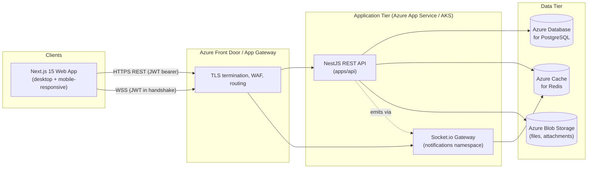

# GS WorkHub — System Architecture

## 1. Overview

GS WorkHub is a multi-tenant-by-department work management platform for GlobalSurf, structured around a single hierarchy:

```
Organization → Department → Team → Project → Milestone → Task → Subtask
```

Departments and Teams are **data, not code** — an administrator creates/edits/archives them through the Admin Panel, and every downstream module (projects, tasks, workload, timesheets, approvals, reports) automatically scopes to whatever org structure exists. No deploy is required to add HR, Finance, an "AI Team", or any other future unit.

## 2. High-Level Architecture



- **Stateless API tier**: every NestJS instance is interchangeable; horizontal scaling is just adding instances behind the load balancer. Session state lives in JWTs + Redis, not in-process memory.
- **Realtime tier**: Socket.io uses a Redis adapter (Phase 2+) so notifications fan out correctly across multiple API instances, not just the instance a socket happens to connect to.
- **Single Postgres database** for all departments (see §5 for the isolation model and its tradeoffs, detailed in `07-scalability-plan.md`).

## 3. Technology Stack (as implemented)

| Layer | Choice | Notes |
|---|---|---|
| Frontend framework | Next.js 15 (App Router) | Route groups per feature area, server components for initial data, client components for interactive views |
| UI kit | Tailwind CSS + ShadCN UI | Themed to brand colors `#CC007A` / `#00A8E1`; `next-themes` for dark/light |
| Client server-state | React Query | All API reads/writes; handles caching, retries, optimistic updates |
| Client UI-state | Zustand | Auth session, sidebar/theme/UI-only state |
| Motion | Framer Motion | Page/panel transitions, drag-and-drop kanban feedback |
| Backend framework | NestJS 10 | Modular monolith (see §4) |
| ORM / schema | Prisma + PostgreSQL | `apps/api/prisma/schema.prisma` is the single source of truth for the data model |
| Cache / session | Redis (ioredis) | Refresh-token/session bookkeeping, report/workload cache, Socket.io adapter |
| Realtime | Socket.io (`@nestjs/websockets`) | `/notifications` namespace, JWT-authenticated handshake |
| Object storage | Azure Blob Storage (`@azure/storage-blob`) | SAS-token upload/download, versioned attachments |
| Auth | JWT access + refresh tokens, bcrypt | Access token short-lived (15m default), refresh token rotated + revocable (hashed at rest) |
| Monorepo tooling | pnpm workspaces + Turborepo | `apps/api`, `apps/web`, `packages/shared`, `packages/config` |

## 4. Backend Architecture (`apps/api`)

NestJS as a **modular monolith**: one deployable process, strict module boundaries. This is the right call at 500-employee scale — microservices would add operational overhead (service discovery, distributed tracing, network hops) without a corresponding scaling need. Splitting a hot module (e.g. Notifications, Reports) into its own service later is a boundary-preserving extraction, not a rewrite, because modules already don't reach into each other's internals.

```
apps/api/src/
  main.ts                    bootstrap, global prefix "api/v1", ValidationPipe, exception filter
  app.module.ts               root module — wires every feature module + global guards/interceptors
  common/
    decorators/                @Roles, @CurrentUser, @Public, @DepartmentScoped
    guards/                    JwtAuthGuard, RolesGuard, DepartmentScopeGuard
    filters/                   GlobalExceptionFilter
    interceptors/              LoggingInterceptor
    types/                     AuthenticatedRequestUser
  prisma/
    prisma.service.ts          PrismaClient wrapper, @Global() module — injectable anywhere, no re-import needed
  modules/
    auth/                      login, refresh, logout — JWT strategy, bcrypt
    employees/                 Module 1 — directory, profile, skills, availability, work history
    departments/               Module 2
    teams/                     Module 3
    projects/                  Module 4 — projects, milestones, templates, health score
    tasks/                     Module 5 — tasks, subtasks, dependencies, comments, activity log
    workload/                  Module 6 — capacity/allocation aggregation (read-only)
    timesheets/                Module 7
    approvals/                 Module 8 — generic approval resource
    notifications/             Module 9 — REST + Socket.io gateway
    files/                     Module 10 — Azure Blob SAS upload/download, version history
    reports/                   Module 13 — dashboards + KPI snapshots
prisma/
  schema.prisma                 data model (see 02-database-erd.md)
  seed.ts                       seeds GlobalSurf org/departments/teams/super-admin
```

**Deliberate module-boundary rule**: feature modules do not import each other. Every module that needs data owned by another domain (Workload needing Task/User, Reports needing Project/Task/TimesheetEntry) queries `PrismaService` directly rather than reaching into another module's service. This keeps 11 feature modules independently understandable and buildable in parallel, at the cost of a few small duplicated aggregation formulas (documented inline where it happens, e.g. the utilization calculation appears in both `workload` and `reports`).

**Cross-cutting concerns**, wired once in `app.module.ts` via `APP_GUARD`/`APP_INTERCEPTOR` so individual modules don't repeat them:
- `JwtAuthGuard` — every route requires a valid access token unless marked `@Public()`.
- `RolesGuard` — reads `@Roles(...)` metadata; no metadata means "any authenticated role."
- `DepartmentScopeGuard` — reads `@DepartmentScoped()` metadata on write routes that carry an explicit `departmentId`; non-SUPER_ADMIN callers are rejected if it doesn't match their own department. List/read endpoints self-filter in the service layer instead (a route-level guard can't know which department a row inside a paginated list belongs to).
- `ThrottlerGuard` — basic rate limiting (200 req/min/IP default).
- `LoggingInterceptor` / `GlobalExceptionFilter` — structured request logging and a consistent error JSON shape.

## 5. Department-Level Isolation Model

Rather than one Postgres schema/database per department (which would multiply migrations, connections, and backup jobs by department count), isolation is enforced at the **application layer**: every department-owned row carries a `departmentId` (or reaches one via `teamId → Team.departmentId` or `projectId → Project.departmentId`), and:

1. `DepartmentScopeGuard` blocks cross-department writes at the HTTP layer.
2. Each service's list/read query filters by the caller's `departmentId`/`teamIds` for every role except `SUPER_ADMIN`.
3. Postgres row-level security is a documented upgrade path (see `07-scalability-plan.md`) if a future compliance requirement demands isolation enforced at the database layer itself, not just the application layer.

## 6. Frontend Architecture (`apps/web`)

```
apps/web/src/
  app/
    (auth)/login/
    (dashboard)/
      layout.tsx               shell: sidebar (org→dept→team nav), topbar, theme toggle
      dashboard/                role-aware landing: company / department / team view
      departments/, departments/[id]/
      teams/[id]/
      projects/, projects/[id]/    tabs: Overview · List · Kanban · Calendar · Timeline
      tasks/                       list + kanban board (shared data, different grouping)
      workload/
      timesheets/
      approvals/
      notifications/
      files/
      admin/departments/, admin/teams/, admin/users/, admin/roles/
  components/
    ui/                         ShadCN primitives
    layout/                     Sidebar, Topbar, PageHeader
    domain/                     ProjectCard, TaskCard, KanbanColumn, WorkloadBar, etc.
  lib/
    api-client.ts                fetch wrapper (attaches JWT, handles 401→refresh)
    query-client.ts               React Query client + query key factories
  store/
    auth-store.ts                Zustand: current user, tokens
    ui-store.ts                   Zustand: sidebar collapsed, theme
  types/                          re-exports from @gs-workhub/shared
```

Server-rendered route segments fetch initial data (fast first paint, good for dashboards); everything interactive (drag-and-drop kanban, live-updating workload bars, forms) is a client component backed by React Query, so cache invalidation and optimistic updates work the same way across the whole app.

## 7. Shared Package (`packages/shared`)

`@gs-workhub/shared` is imported by both apps and holds only what must never drift between them:
- **Enums** (`enums.ts`) mirroring every Prisma enum by value — the single place a new `TaskStatus` value would be added conceptually, even though Prisma's own enum in `schema.prisma` is the runtime source of truth for the database.
- **Types** (`types.ts`) — plain TypeScript interfaces for API payloads, used by the frontend for typing fetch responses.
- **Zod schemas** (`schemas.ts`) — form validation shared conceptually with backend DTO rules (backend DTOs use `class-validator` independently, since Nest's `ValidationPipe` doesn't consume Zod directly; the two are kept in sync by convention, not by shared code, and it's worth revisiting if drift becomes a problem).

## 8. Folder Structure (repo root)

```
gs_workhub/
  apps/api/            NestJS backend — see §4
  apps/web/             Next.js frontend — see §6
  packages/shared/       cross-app enums/types/schemas
  packages/config/        shared tsconfig base
  docs/                   this documentation set
  docker-compose.yml      local Postgres + Redis for development
  turbo.json, pnpm-workspace.yaml, package.json
  .env.example
```
