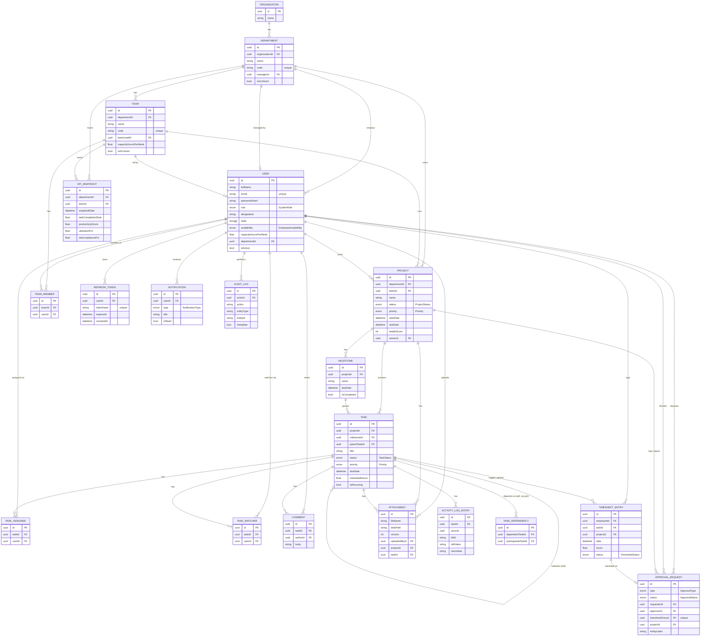

# GS WorkHub — Database ERD

Source of truth: [`apps/api/prisma/schema.prisma`](../apps/api/prisma/schema.prisma). This document is the rendered view of that file — if the two ever disagree, the Prisma schema wins and this diagram should be regenerated from it.

## 1. Entity-Relationship Diagram

## 2. Enum Reference

| Enum | Values |
|---|---|
| `SystemRole` | `SUPER_ADMIN`, `DEPARTMENT_MANAGER`, `TEAM_LEAD`, `EMPLOYEE`, `CLIENT` |
| `EmployeeAvailability` | `AVAILABLE`, `PARTIALLY_AVAILABLE`, `UNAVAILABLE`, `ON_LEAVE` |
| `ProjectStatus` | `PLANNING`, `IN_PROGRESS`, `ON_HOLD`, `REVIEW`, `COMPLETED`, `CANCELLED` |
| `Priority` | `CRITICAL`, `HIGH`, `MEDIUM`, `LOW` |
| `TaskStatus` | `BACKLOG`, `TODO`, `IN_PROGRESS`, `REVIEW`, `TESTING`, `COMPLETED` |
| `TimesheetStatus` | `SUBMITTED`, `PENDING_APPROVAL`, `APPROVED`, `REJECTED` |
| `ApprovalType` | `TIMESHEET`, `LEAVE`, `TASK`, `CONTENT`, `DESIGN`, `PROJECT` |
| `ApprovalStatus` | `DRAFT`, `SUBMITTED`, `PENDING`, `APPROVED`, `REJECTED` |
| `NotificationType` | `TASK_UPDATE`, `PROJECT_UPDATE`, `APPROVAL_REQUEST`, `DUE_DATE_REMINDER`, `TEAM_ANNOUNCEMENT`, `MENTION` |

These are mirrored (by value, not by shared code) in `packages/shared/src/enums.ts` for frontend use.

## 3. Design Notes

- **UUID primary keys** everywhere (`@default(uuid())`) rather than auto-increment integers — safe to generate client-side, don't leak row counts, and avoid collisions if data is ever merged across environments.
- **`Approval` is a generic resource**, not one table per approval type. `ApprovalRequest.type` discriminates; `timesheetEntryId` and `projectId` are the only two typed FKs (timesheet approvals and project approvals are the two flows with a concrete linked record today). Leave/Task/Content/Design approvals use the free-text `entityLabel` field. This trades a little type safety for one dashboard/API surface across every approval kind — revisit if a specific approval type grows enough custom fields to earn its own table.
- **Task subtasks** are the same `Task` table via a self-relation (`parentTaskId`) rather than a separate `Subtask` table — a subtask is a task with a parent, full stop, so it can have its own subtasks, assignees, comments, etc. without a parallel schema.
- **Task dependencies** are a many-to-many join (`TaskDependency`) rather than a single `blockedBy` column, so a task can depend on multiple prerequisites.
- **Attachments carry `version` as a plain integer**, with a new row per version rather than a mutable "latest" row — full version history without a separate history table.
- **Department/Team `code`** is unique and human-assigned (e.g. `DIGITAL-DEV`) — used in seed data, URLs, and integration references, distinct from the internal UUID `id`.
- **No soft-delete flag on every table** — only entities with a real archival concept (`Department.isArchived`, `Team.isArchived`, `User.isActive`, `Project.status = CANCELLED`) support "remove without deleting." Tasks/comments/timesheets are hard-deleted where the module logic allows it, since they don't carry cross-module references the way an org unit does.
