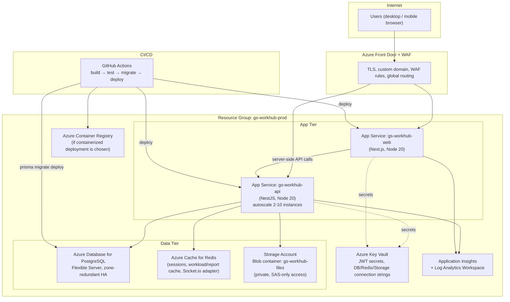

# GS WorkHub — Deployment & Azure Infrastructure Design

This is an infrastructure **design**, not a provisioned environment — nothing described here has been deployed as part of this engagement. It is written to be handed directly to whoever provisions Azure resources.

## 1. Target Azure Architecture

## 2. Compute Choice: App Service vs. AKS

**Recommendation for launch: Azure App Service (Linux, Node 20)** for both `apps/api` and `apps/web`, one App Service Plan per environment (dev/staging/prod), with the API app's autoscale rule keyed on CPU% and request queue length.

Move to **Azure Kubernetes Service (AKS)** only when a concrete need shows up — e.g. Phase 3/4 introduces a workload (AI inference, video processing for Phase 3's marketing/content modules) that needs its own scaling profile independent of the API, or the team wants blue/green deploys with finer traffic-shifting than App Service slots provide. Provisioning Kubernetes before there's a scaling reason to justify its operational overhead (cluster upgrades, node pool management, more moving parts to secure) is optimizing for a problem GS WorkHub doesn't have yet at 500 employees.

## 3. Environments

| Environment | Purpose | Notes |
|---|---|---|
| `dev` | Engineering integration | Shared Postgres (small SKU), can be torn down/rebuilt freely |
| `staging` | UAT / department pilot | Mirrors prod topology at smaller SKU, real Azure AD test users |
| `prod` | GlobalSurf company-wide | Zone-redundant Postgres HA, autoscaled API, WAF enabled |

## 4. CI/CD Pipeline (GitHub Actions)

1. **On PR**: `pnpm install`, `pnpm lint`, `pnpm typecheck`, `pnpm build` (Turborepo caches unaffected packages), Prisma `migrate diff` check against the target schema (fails the PR if a migration is missing for a schema change).
2. **On merge to `main`**: build both apps, run `prisma migrate deploy` against `staging`, deploy both App Services to `staging` slots, run smoke tests (login + one read from each module), swap slots.
3. **On tagged release**: same pipeline promoted to `prod` with manual approval gate.

## 5. Secrets & Configuration

- All secrets (`JWT_ACCESS_SECRET`, `JWT_REFRESH_SECRET`, `DATABASE_URL`, `REDIS_URL`, `AZURE_STORAGE_CONNECTION_STRING`) live in **Azure Key Vault**, referenced by App Service via Key Vault references — never committed, never in App Service's plain app settings blade for prod.
- `.env.example` at the repo root documents every variable a developer needs locally; local dev uses `docker-compose.yml` (Postgres + Redis) with the placeholder values already in that file.

## 6. Networking & Security

- Azure Front Door + WAF in front of both App Services; only Front Door's origin IPs are allowed through App Service access restrictions (no direct public origin access).
- Postgres Flexible Server on a private VNet integration, no public endpoint in staging/prod.
- Storage Account container is **private**; all file access goes through the API's SAS-URL endpoints (`/files/upload-url`, `/files/:id/download-url`), never a public blob URL.
- TLS everywhere (Front Door terminates, re-encrypts to origin).

## 7. Observability

- **Application Insights** on both App Services — request tracing, dependency calls (Postgres/Redis/Blob), exception tracking (feeds off the same errors the `GlobalExceptionFilter` already logs).
- **Log Analytics Workspace** aggregates App Service + Postgres + Redis diagnostic logs.
- Alerts: API 5xx rate, Postgres CPU/connection saturation, Redis memory, Blob Storage 4xx spike (SAS token misuse/expiry pattern).

## 8. Backup & DR

- Postgres: automated daily backups + zone-redundant HA in prod, 35-day retention (Azure default max), point-in-time restore tested quarterly.
- Blob Storage: soft-delete + versioning enabled on the container (dovetails with the app-level `Attachment.version` history already in the schema).
- RTO/RPO targets to formalize with GlobalSurf IT before go-live — not assumed here.
